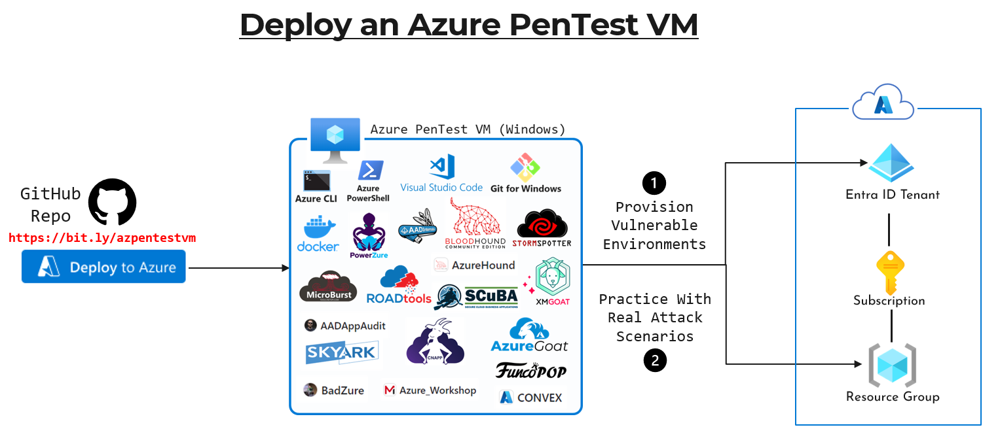

# Azure Pentest VM (Windows)

   

The 'post-deployment' installation custom script extension will take around 15 to 20 minutes to complete.

     

## Attack and Assessment Tools
- Visual Studio Code; Git for Windows; Docker Desktop
- **Azure PowerShell**
  - https://learn.microsoft.com/en-us/powershell/azure/install-azps-windows
- **Azure CLI**
  - https://learn.microsoft.com/en-us/cli/azure/install-azure-cli-windows
- **AzureAD PowerShell Module**
  - https://www.powershellgallery.com/packages/AzureAD
  - https://learn.microsoft.com/en-us/powershell/azure/active-directory/overview
- **AzureADPreview PowerShell Module**
  - https://www.powershellgallery.com/packages/AzureADPreview/2.0.2.183
  - https://learn.microsoft.com/en-us/powershell/azure/active-directory/install-adv2?view=azureadps-2.0
- **Microsoft Graph PowerShell Module (Preview)**
  - https://www.powershellgallery.com/packages/Microsoft.Graph
  - https://learn.microsoft.com/en-us/powershell/microsoftgraph
- **AADInternals**
  - https://aadinternals.com/aadinternals
  - https://github.com/Gerenios/AADInternals
- **MicroBurst**
  - https://github.com/NetSPI/MicroBurst
- **PowerZure**
  - https://github.com/hausec/PowerZure
  - https://powerzure.readthedocs.io/en/latest/
- **BloodHound**
  - https://github.com/BloodHoundAD/BloodHound
  - https://github.com/SpecterOps/BloodHound
- **AzureHound**
  - https://github.com/BloodHoundAD/AzureHound
- **FuncoPop**
  - https://github.com/NetSPI/FuncoPop
- **BARK**
  - https://github.com/BloodHoundAD/BARK
- **ROADTool**
  - https://github.com/dirkjanm/ROADtools
- **SkyArk**
  - https://github.com/cyberark/SkyArk
- **ScoutSuite**
  - https://github.com/nccgroup/ScoutSuite/wiki/Setup
- **Azure-AccessPermissions**
  - https://github.com/csandker/Azure-AccessPermissions
- **ScubaGear**
  - https://github.com/cisagov/ScubaGear
- **AADAppAudit**
  - https://github.com/jsa2/AADAppAudit

## Vulnerable Environment Tools
- **BadZure**
  - https://github.com/mvelazc0/BadZure
- **CNAPPGoat**
  - https://github.com/ermetic-research/cnappgoat
  - https://github.com/ermetic-research/cnappgoat-scenarios
- **AzureGoat**
  - https://github.com/ine-labs/AzureGoat
- **XMGoat**
  - https://github.com/XMCyber/XMGoat
- **Mandiant Azure Workshop**
  - https://github.com/mandiant/Azure_Workshop
- **Convex**
  - https://github.com/Azure/CONVEX

